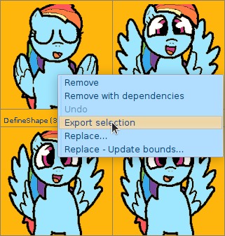
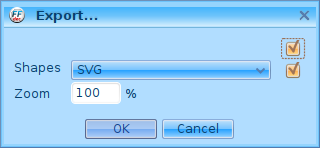
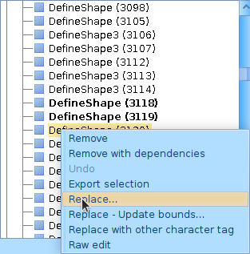
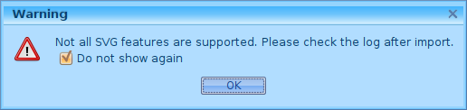

# Simple recolor guide

JAVA REQUIRED

# [CLI and Automation Guide](/proguide)

## Gui(Multiplatform, slow)

### Setup

0-Create a directory to keep things more organized.

1-Download [ffdec](https://github.com/jindrapetrik/jpexs-decompiler/releases/download/version15.0.0/ffdec_15.0.0.zip) and extract it in your work directory.

2-Download the [SWF file](https://u.smutty.horse/lzxwgipcsiz.swf).

3-Open ffdec, either drag and drop the SWF file or click 'Open...' and navigate to it.

4-Click on 'shapes', scroll and select what you want to edit(hold Ctrl to select multiple), then right click 'Export selection' the recommended format is SVG, but PNG is supported, export to your work directory.

### Editing

0a-If you chose SVG you can use [(Recommendation) Inkscape](https://inkscape.org/), but you could probably use Adobe Illustrator (Or even a text editor).

0b-If you chose PNG you can use [(Recommendation) Gimp](https://www.gimp.org/), but any image editor that supports transparency works.

1-Save overwriting the files.

### Replacing sprites

0-Go back to ffdec

1-Double-click the first thing you want to replace

2-On the left panel right-click the selected item then 'Replace...'

3-Accept the warning(Check 'Do not show again')

4-Select the file with matching number and click 'Open'.

5-Select the next item and repeat step 4, until you finish.

### Rebuild SWF

0-Click 'Save as'

1-Type a filename and save.

2-Test your file either in [Standalone Flash Player](https://www.adobe.com/support/flashplayer/debug_downloads.html) or [bfed.ga](https://bfed.ga/)(apparently only works on Firefox, I'm looking into that)

3-If it works, don't be afraid to share it.

